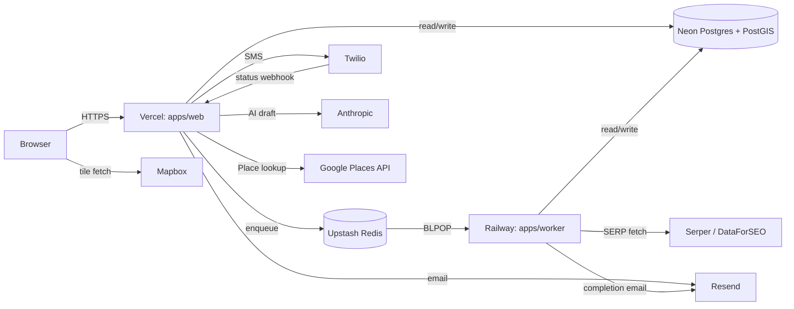

# System Diagram

alauda-app runs as two long-lived processes — `apps/web` on Vercel and
`apps/worker` on Railway — sharing one Neon Postgres database and one
Upstash Redis queue. Browsers talk only to `apps/web` and Mapbox tiles;
every other external service sits behind one of the two backend
processes.

## Deployment topology

The split between `apps/web` and `apps/worker` is fixed by
[ADR-003](decisions.md#adr-003-single-nextjs-app-topology-1) and
[ADR-006](decisions.md#adr-006-worker-topology-unchanged-w1). Every
stateful service in the diagram belongs to alauda-app alone — see
[ADR-010](decisions.md#adr-010-source-repo-coexistence-alpha--isolation)
for the isolation posture against the source repos.

Three edges deserve a note. First, `Twilio -> Vercel` is the only
inbound webhook in the system; it lands on `/api/sms/status-callback`
and authenticates via HMAC-SHA1 rather than a session cookie. Second,
`Railway -> Resend` exists because the scan-complete email is sent from
the worker that owns finalization, not from the web tier that owns user
sessions. Third, the browser fetches Mapbox tiles directly with a
public token; tiles never proxy through `apps/web`.

## Async flows

### Scan creation

1. Browser POSTs `/api/scan` with `{keyword, radius, optional email}`
2. `apps/web` computes a 5x5 grid and writes one `Scan` plus 25
   `GridPoint` rows to Neon
3. `apps/web` enqueues 25 jobs to Upstash Redis on the BullMQ
   `serp-fetch` queue
4. `apps/worker` BLPOPs each job and hits Serper / DataForSEO under a
   per-provider rate limit and a token-bucket QPS cap
5. `apps/worker` writes one `ScanResult` and one `UsageLedger` row per
   job to Neon
6. `apps/worker` triggers the atomic finalizer marker when the last
   job completes and, if the requester opted into email, calls Resend
   with the scan-complete template
7. Browser polls `/api/scan/[id]/status` every 1s and renders results
   when the marker reports done

### Reviews send loop

1. Vercel Cron invokes `/api/cron/send-reviews` every minute, presenting
   `Bearer $CRON_SECRET`
2. The endpoint scans Neon for `ReviewRequest` rows where
   `scheduledSendAt <= now AND sentAt IS NULL` and takes 10 rows per
   tick
3. The endpoint re-validates each Google review URL, enforces the
   per-business velocity cap, and optimistically claims rows via
   `updateMany`
4. The endpoint calls Resend (email) or Twilio's raw HTTPS
   `Messages.json` endpoint (SMS) via the inherited `Notifier`
   abstraction (`src/lib/notifier.ts` from Review_MLP)
5. Twilio POSTs a status update to `/api/sms/status-callback`; the
   endpoint verifies HMAC-SHA1 and writes `smsDeliveredAt`
6. On send failure the endpoint rolls back `sentAt` so the row retries
   on the next minute's tick

### Magic-link login

1. User submits an email at `/login` or `/signup`
2. `apps/web` calls `signMagicLink(email)` and sends the link via Resend,
   pointing at `/api/auth/verify?token=...&next=...`
3. User clicks the link in the email
4. `/api/auth/verify` exchanges the magic JWT for a session JWT
   (15-minute magic expiry, 30-day session, HttpOnly SameSite=Lax
   cookie)
5. The endpoint 307-redirects to `next` (default `/dashboard`); on
   validation failure it 307-redirects to
   `/login?error=invalid_or_expired`

## Process inventory

| Process | Host | Trigger | Execution model |
|---|---|---|---|
| `apps/web` (Next.js) | Vercel | HTTP request | per-request (Vercel function) |
| Vercel Cron | Vercel | every minute | sequential (one tick at a time) |
| `apps/worker` | Railway | Redis BLPOP | 25 concurrent jobs |

`apps/web` runs as Vercel Functions per request. Vercel Cron is the
same deployment invoked on schedule, so it shares the `apps/web` build
but runs one tick at a time and authenticates with `Bearer
$CRON_SECRET` to keep the endpoint reachable only by the cron driver.
`apps/worker` is a single Railway service that pulls jobs from the
`serp-fetch` queue with a BullMQ concurrency of 25; the upstream
provider QPS cap, not BullMQ concurrency, is the binding throughput
limit on Scan. PR-preview deploys do not stand up a worker, which is
the documented caveat in
[ADR-006](decisions.md#adr-006-worker-topology-unchanged-w1) — local
dev (`pnpm dev:web` plus `pnpm dev:worker`) covers the gap when
end-to-end testing on a preview is needed.
