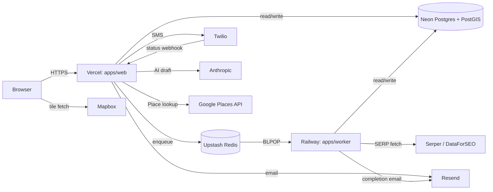
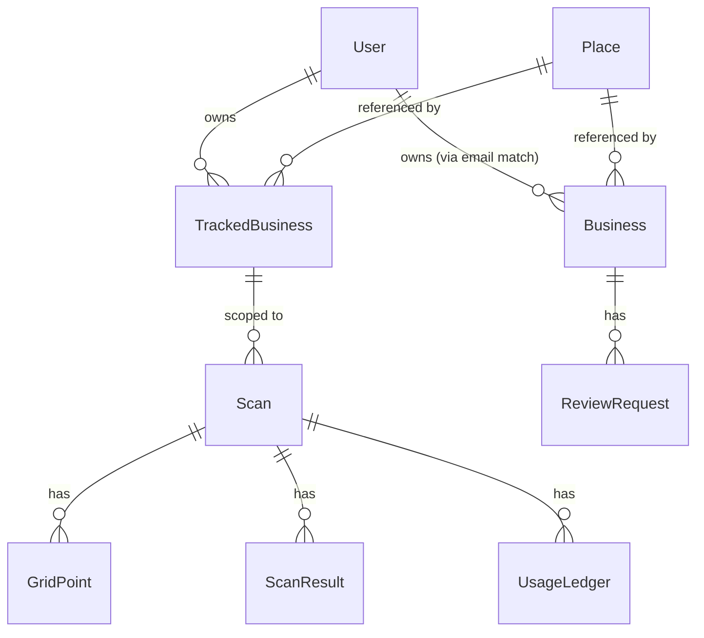

# Alauda-App Blueprint Implementation Plan

> **For agentic workers:** REQUIRED SUB-SKILL: Use superpowers:subagent-driven-development (recommended) or superpowers:executing-plans to implement this plan task-by-task. Steps use checkbox (`- [ ]`) syntax for tracking.

**Goal:** Translate the approved design spec at `docs/design/2026-05-04-alauda-app-blueprint-design.md` into 13 markdown files at the alauda-app repo root (the blueprint deliverable), modelled on `AlaudaAI/website-rebuild`'s first-commit blueprint.

**Architecture:** This plan produces *only documentation*. No code, no scaffolding, no `apps/` or `packages/` directories. The 13 files articulate the 8 ADRs, the merged data model, the routing/shell/auth specs, the deployment ops, and the fork & lift + sync runbooks. Each file is independently authored from the spec; tasks can run in any order after Task 1.

**Tech Stack:** Markdown only. Mermaid for diagrams (`architecture/system-diagram.md`, `domain/data-model.md`). No build step, no test runner — verification is "file exists, content matches spec coverage".

**Source of truth:** Every task references specific sections of `docs/design/2026-05-04-alauda-app-blueprint-design.md`. The spec is comprehensive — the tasks below tell you *which spec sections* to draw from for each file, not what to write from scratch.

---

## Spec Coverage Map

| Spec section | Lands in blueprint file(s) |
|---|---|
| Meta principle, 8 ADRs, α + isolation, Out of scope | `architecture/decisions.md` |
| External services list (Section 3 + 5) | `architecture/integration-points.md` (catalog) + `ops/deployment.md` (env vars) |
| Inherited operational constants (mentioned across spec) | `architecture/constants.md` |
| System diagram (Section 5 deployment + Section 2 packages) | `architecture/system-diagram.md` |
| Merged Prisma schema (Section 3) | `domain/data-model.md` |
| Shell layout, Sidebar v2, BusinessSwitcher, onboarding (Section 4) | `specs/shell.md` |
| `@alauda/auth` API, middleware decision tree, magic-link callback (Section 3 + 4) | `specs/auth.md` |
| Full route table, public allowlist, R1 implementation (Section 4) | `specs/routing.md` |
| Local_Map_SEO file mapping (Section 6 Phases 3-4) | `specs/scan-integration.md` |
| Review_MLP file mapping (Section 6 Phase 5) | `specs/reviews-integration.md` |
| Vercel + Railway, env groups, build commands, PR-preview limitation, local dev (Section 5) | `ops/deployment.md` |
| Neon + PostGIS + baseline migration (Section 3 + 5) | `ops/database.md` |
| Phase 0-6 runbook (Section 6) | `plan/fork-and-lift-day.md` |
| Phase 7 ongoing sync (Section 6) | `plan/sync-strategy.md` |
| Top-level overview / what is alauda-app | `README.md` |

---

## File Structure

All paths are relative to alauda-app repo root.

```
alauda-app/
├── README.md                        ← Task 1
├── architecture/
│   ├── decisions.md                 ← Task 2
│   ├── constants.md                 ← Task 3
│   ├── system-diagram.md            ← Task 4
│   └── integration-points.md        ← Task 5
├── domain/
│   └── data-model.md                ← Task 6
├── specs/
│   ├── shell.md                     ← Task 7
│   ├── auth.md                      ← Task 8
│   ├── routing.md                   ← Task 9
│   ├── scan-integration.md          ← Task 10
│   └── reviews-integration.md       ← Task 11
├── ops/
│   ├── deployment.md                ← Task 12
│   └── database.md                  ← Task 13
└── plan/
    ├── fork-and-lift-day.md         ← Task 14
    └── sync-strategy.md             ← Task 15
```

**Conventions for every file:**

- Use second-person ("you") sparingly. Default to declarative ("alauda-app does X").
- Code blocks: TypeScript-flavoured pseudo-code is fine where helpful. Mark explicitly when a snippet is illustrative vs. literal.
- Cross-references between blueprint files use relative markdown links (`[decisions](../architecture/decisions.md)`).
- Headings: H1 = file title, H2 = top-level sections, H3 = sub-sections. Avoid H4+ unless necessary.
- File length: aim for 100-400 lines each. If a file exceeds 500 lines, consider splitting (but most won't reach this).

**Tone/voice:** Match the spec — direct, opinionated, pragmatic. No hedging. State decisions, then state reasons.

---

## Pre-flight: Branch and worktree decision

The spec doc is on branch `docs/blueprint-design` (PR #1, not yet merged). The blueprint files this plan produces will be substantial (~13 new files, several hundred lines each) — they should land in a **separate PR** so PR #1 stays focused on "this is the design, here's the rationale" while the blueprint itself ships in its own focused PR.

Branch strategy: create `docs/blueprint-files` off **`docs/blueprint-design`** (so it inherits the spec context) and PR it once the spec PR merges, OR create `docs/blueprint-files` off `main` after PR #1 merges. The latter is cleaner. The former lets the blueprint files cite the spec's still-merging path without breaking links.

Recommendation: wait for PR #1 to merge → create `docs/blueprint-files` from `main` → execute Tasks 1-15 → push → open PR #2.

This decision is for Jason at execution time. The plan itself does not commit to either.

---

## Task 1: README.md (root)

**Files:**
- Create: `README.md`

- [ ] **Step 1: Read spec sections "What is alauda-app", "Meta principle", "Out of scope", "Decisions (the 8 ADRs)", "Coexistence model"**

The README is the blueprint's front door. It must answer in this order:

1. **What is alauda-app?** (3-5 sentences) — derived from spec's "What is alauda-app" section.
2. **What is this directory?** (2-3 sentences) — explain it's a documentation blueprint, no code; the actual implementation comes later via the runbook in `plan/fork-and-lift-day.md`.
3. **Directory map** (the tree from spec Section 1) with one-line descriptions of each file, hyperlinked.
4. **How to read this** (5-7 ordered bullets) — recommended reading order: `architecture/decisions.md` first (the 8 ADRs and why), then `domain/data-model.md`, then `architecture/system-diagram.md`, then `specs/*.md`, then `ops/*.md`, then `plan/*.md`.
5. **What this blueprint does NOT include** (3-5 bullets from spec's "Out of scope") — D1 unification, agency model, billing, marketing, internal redesign, freezing source repos.
6. **Source repos** (2 bullets) — link to `AlaudaAI/Local_Map_SEO` and `AlaudaAI/Review_MLP` with one-sentence each on what they do.

- [ ] **Step 2: Write the file**

Output target: 80-150 lines. Pure markdown. No code blocks except the directory tree.

- [ ] **Step 3: Verify**

Run: `cat README.md | head -50` — confirm the top section is the "What is alauda-app" framing.
Run: `wc -l README.md` — confirm 80-150 lines.

- [ ] **Step 4: Commit**

```bash
git add README.md
git commit -m "docs: add blueprint README"
```

---

## Task 2: architecture/decisions.md

**Files:**
- Create: `architecture/decisions.md`

- [ ] **Step 1: Read spec sections "Meta principle", "Decisions (the 8 ADRs)", "Coexistence model with source repos", "Out of scope"**

This file holds *every* decision in the blueprint as ADR entries. It is the single source the README points readers at first.

Structure (in this order):

1. **Meta principle** as ADR-001 — quote from spec's Meta principle section, explain that it constrains every following ADR.
2. **ADR-002 through ADR-009** — one per decision: C, 拓扑 1, A1, R1, W1, S1, T3, Sidebar v2. Each ADR follows this template:

```markdown
## ADR-NNN: <short name> (<decision id>)

**Context:** <1-2 sentences on what choice had to be made>

**Decision:** <1 sentence stating the choice>

**Rejected alternatives:** <2-3 bullet items, each one-line "X — rejected because Y">

**Consequences:** <3-5 bullets on what this decision pulls in>
```

The spec's decisions table gives you the "decision" + "why" condensed. Expand each into the 4-section ADR format above. Use the brainstorming conversation context as the source for "rejected alternatives" (e.g., for A1, the rejected alternatives were A2 hosted IDP, A3 own sign-in repo, A4 abstract-package-with-implementation-deferred).

3. **ADR-010: α + isolation coexistence** — derived from spec's "Coexistence model" section. Document that alauda-app and source repos run as fully independent deployments with no shared infrastructure, that source repos are not paused or frozen, that sync is opportunistic cherry-pick.
4. **ADR-011: Out-of-scope items** — list each out-of-scope item from the spec with a one-sentence rationale for why it is deferred.

- [ ] **Step 2: Write the file**

Output target: 250-400 lines. Each ADR is 15-30 lines.

- [ ] **Step 3: Verify**

Run: `grep -c "^## ADR-" architecture/decisions.md` — expect 11 (ADR-001 through ADR-011).
Run: `grep -E "^\*\*(Context|Decision|Rejected alternatives|Consequences):\*\*" architecture/decisions.md | wc -l` — expect 40 (4 sections × 10 ADRs that use the template; ADR-001 meta-principle and ADR-011 out-of-scope may use a different shape).

- [ ] **Step 4: Commit**

```bash
git add architecture/decisions.md
git commit -m "docs: add architecture decisions (11 ADRs)"
```

---

## Task 3: architecture/constants.md

**Files:**
- Create: `architecture/constants.md`

- [ ] **Step 1: Identify constants from spec + source repos**

The constants below are inherited from source repos. This file is an **index pointing to where each lives**, not a redefinition.

| Domain | Constant | Source |
|---|---|---|
| Auth | magic-link expiry: 15 minutes | `Review_MLP/src/lib/auth.ts` (purpose:"magic" JWT) |
| Auth | session expiry: 30 days | `Review_MLP/src/lib/auth.ts` (purpose:"session" JWT) |
| Auth | session cookie: HttpOnly, SameSite=Lax | `Review_MLP/src/lib/session.ts` |
| Auth | `AUTH_SECRET` minimum length: 32 bytes | `Review_MLP/src/lib/env.ts` |
| BullMQ | worker concurrency: 25 (env-driven via `SERP_WORKER_CONCURRENCY`) | `Local_Map_SEO/apps/worker/src/index.ts` |
| BullMQ | retry: exponential backoff | `Local_Map_SEO/apps/worker/src/processors/serp-fetch.ts` |
| SERP | per-provider QPS cap: env `SERP_QPS` (TokenBucket lazy refill) | `Local_Map_SEO/packages/jobs/src/rate-limit.ts` |
| Reviews | velocity cap: `VELOCITY_CAP` env, default 3 per rolling 24h | `Review_MLP/src/lib/scheduling.ts` |
| Reviews | per-business 30-day dedup window (phone + email hash) | `Review_MLP/src/lib/contact.ts` |
| Reviews | send window: 9am-9pm CT, jitter 60-180min | `Review_MLP/src/lib/scheduling.ts` |
| Place cache | 7-day memoization (Place lookup) | `Local_Map_SEO/apps/web/src/app/api/business/select/route.ts` |
| Cron | Vercel Cron cadence: every minute (Pro plan required) | `Review_MLP/vercel.json` |
| Cron | cron batch size: 10 rows per tick | `Review_MLP/src/app/api/cron/send-reviews/route.ts` |
| Scan grid | 5×5 grid, 25 points | `Local_Map_SEO/apps/web/src/lib/grid.ts` |
| Magic-link rate-limit | per-User cooldown via `User.lastMagicLinkSentAt` | `packages/auth` after fork & lift (was `Business.lastMagicLinkSentAt` in source) |

- [ ] **Step 2: Write the file**

Structure:

```markdown
# Operational Constants

alauda-app inherits all operational constants from source repos. This index points to where each lives so readers do not have to grep two upstream codebases.

**Why an index, not values:** [1-2 sentences explaining the meta principle — alauda-app does not redefine constants. Tuning happens in source repos and propagates via Phase 7 sync.]

## Inherited constants

[The full table above]

## Source repo references

- [`AlaudaAI/Local_Map_SEO`](https://github.com/AlaudaAI/Local_Map_SEO) — Scan SERP fetch, BullMQ worker, Place cache, grid math
- [`AlaudaAI/Review_MLP`](https://github.com/AlaudaAI/Review_MLP) — magic-link auth, Reviews scheduling, Vercel Cron, Twilio SMS
```

Output target: 70-120 lines.

- [ ] **Step 3: Verify**

Run: `grep -c "^|" architecture/constants.md` — expect ≥ 16 (the table has at least 15 rows + header + separator).

- [ ] **Step 4: Commit**

```bash
git add architecture/constants.md
git commit -m "docs: add architecture constants index"
```

---

## Task 4: architecture/system-diagram.md

**Files:**
- Create: `architecture/system-diagram.md`

- [ ] **Step 1: Read spec Section 5 (deployment topology) + Section 2 (monorepo layout)**

This file shows the runtime topology of alauda-app: what processes run where, what they talk to, and which external services are involved.

- [ ] **Step 2: Write the file**

Use a mermaid diagram. Structure:

```markdown
# System Diagram

[1-2 sentence overview of the runtime topology]

## Deployment topology



## Async flows

### Scan creation
[Brief sequence: browser POST /api/scan → apps/web writes Scan + 25 GridPoints to Neon → enqueues 25 jobs to Upstash → apps/worker BLPOP → Serper → write ScanResult → atomic finalizer → Resend completion email]

### Reviews send loop
[Brief sequence: Vercel Cron tick → /api/cron/send-reviews scans Neon for due rows → optimistic claim → Twilio/Resend → status webhook → marks delivered]

### Magic-link login
[Brief sequence: /api/auth/request → Resend email → user clicks → /api/auth/verify → set session cookie → 307 to /dashboard]

## Process inventory

| Process | Host | Trigger | Concurrency |
|---|---|---|---|
| apps/web (Next.js) | Vercel | HTTP request | per-request |
| Vercel Cron | Vercel | every minute | sequential |
| apps/worker | Railway | Redis BLPOP | 25 |
```

Output target: 120-200 lines.

- [ ] **Step 3: Verify**

Run: `grep -c "mermaid" architecture/system-diagram.md` — expect at least 1 (the deployment topology diagram block).
Run: `grep -E "^### " architecture/system-diagram.md | wc -l` — expect 3 (three async flows).

- [ ] **Step 4: Commit**

```bash
git add architecture/system-diagram.md
git commit -m "docs: add architecture system diagram"
```

---

## Task 5: architecture/integration-points.md

**Files:**
- Create: `architecture/integration-points.md`

- [ ] **Step 1: Identify the seams from spec sections 3, 4, and 6**

This file is the catalog of "where the two products meet" — the unavoidable seams the blueprint exists to address. Each entry: what was the conflict, what's the resolution, where to find the spec for it.

The seams (compiled from the brainstorming):

1. **Route namespace collision** — both products had `/r/[token]`. Resolution: R1 namespacing. Detail: `specs/routing.md`.
2. **Prisma schema coexistence** — both products have models in their own `prisma/schema.prisma`. Resolution: S1 flat merge in `packages/db`. Detail: `domain/data-model.md`.
3. **User identity bridging** — Local_Map_SEO had empty `User` table (cookie identity); Review_MLP had no `User` (Business.ownerEmail = identity). Resolution: User table is the shared identity; Reviews uses soft `Business.ownerEmail = User.email` bridge; Scan uses `TrackedBusiness.userId = User.id`. Detail: `specs/auth.md`.
4. **Magic-link rate-limit relocation** — Review_MLP had `Business.lastMagicLinkSentAt`. Resolution: moved to `User.lastMagicLinkSentAt` because User is now the identity. Detail: `specs/auth.md`.
5. **Async pattern coexistence** — Scan uses BullMQ + Railway long-lived worker; Reviews uses Vercel Cron + short jobs. Resolution: W1 — both coexist. Detail: `ops/deployment.md`.
6. **Cookie semantics** — Local_Map_SEO had `currentBusinessId` cookie + `?businessId=` promotion middleware; Review_MLP had session cookie carrying email. Resolution: alauda-app middleware composes both (Local_Map_SEO's business cookie + new session cookie from `@alauda/auth`). Detail: `specs/auth.md`.
7. **Onboarding dual-write** — first-login User has zero businesses; need to create both `Business` (Reviews) + `TrackedBusiness` (Scan) sharing one `Place`. Detail: `specs/shell.md`.
8. **Migration history reset** — both products have separate migration histories; merging is hard with no production data. Resolution: baseline reset. Detail: `ops/database.md`.
9. **Marketing landing collision** — both products have a `/` landing page. Resolution: T3 — neither retained; `/` is auth-state redirect. Detail: `specs/routing.md`.
10. **Settings page collision** — both products have a `/settings`. Resolution: per-tool settings stay namespaced (`/scan/settings`, `/reviews/settings`); no global `/settings`. Detail: `specs/shell.md`.

- [ ] **Step 2: Write the file**

Structure:

```markdown
# Integration Points

The blueprint exists to address the unavoidable seams that appear when two
independent products fold into one Next.js app, one database, and one
auth flow. Each entry below names a seam, states the resolution, and
points to the spec file that defines the resolution in detail.

## Catalog

[A numbered list with each of the 10 seams above, formatted as:]

### N. <seam name>

**Conflict:** [1-2 sentences]

**Resolution:** [1-2 sentences, with the decision id like (R1)]

**Spec:** [link to the file in this blueprint that defines it]

[Repeat for all 10]
```

Output target: 150-250 lines.

- [ ] **Step 3: Verify**

Run: `grep -cE "^### [0-9]+\. " architecture/integration-points.md` — expect 10.

- [ ] **Step 4: Commit**

```bash
git add architecture/integration-points.md
git commit -m "docs: add architecture integration points catalog"
```

---

## Task 6: domain/data-model.md

**Files:**
- Create: `domain/data-model.md`

- [ ] **Step 1: Read spec Section 3 "@alauda/db" + Section 4 onboarding dual-write**

This file is the merged Prisma schema sketch + ER diagram. It covers:

- Identity: `User`
- Scan tool: `Place`, `TrackedBusiness`, `Scan`, `GridPoint`, `ScanResult`, `UsageLedger`
- Reviews tool: `Business`, `ReviewRequest`

For each model, list:
- Fields (key fields and their roles, not full schema)
- Source repo origin
- Integration-layer changes (none for most; only `User` gains `lastMagicLinkSentAt`, only `Business` loses it, only `TrackedBusiness.userId` becomes NOT NULL)

- [ ] **Step 2: Write the file**

Structure:

```markdown
# Data Model

alauda-app's `packages/db` exports a single Prisma schema covering both products. Models from Local_Map_SEO and Review_MLP coexist flat in the `public` Postgres schema with no name collisions (S1).

## ER diagram



## Models

### Identity

#### User
[Fields, source, integration changes]

### Scan tool (inherited from Local_Map_SEO)

#### Place
#### TrackedBusiness
#### Scan
#### GridPoint
#### ScanResult
#### UsageLedger

### Reviews tool (inherited from Review_MLP)

#### Business
#### ReviewRequest

## Integration-layer changes (only)

[Three bullet items as per spec Section 3]

## Bridging rules

- **Reviews ownership:** runtime `Business.ownerEmail = currentUser.email`. No FK; soft bridge.
- **Scan ownership:** `TrackedBusiness.userId = currentUser.id`. Hard FK after fork-and-lift baseline migration.
- **Onboarding dual-write:** first login creates one `Business` + one `TrackedBusiness` sharing one `Place`. Detail: `specs/shell.md`.

## Migration policy

[2-3 paragraphs from spec Section 3 "Migration strategy: baseline reset"]
```

Output target: 200-350 lines.

- [ ] **Step 3: Verify**

Run: `grep -c "^####" domain/data-model.md` — expect 9 (one per model).
Run: `grep -c "mermaid" domain/data-model.md` — expect ≥ 1 (ER diagram block).

- [ ] **Step 4: Commit**

```bash
git add domain/data-model.md
git commit -m "docs: add domain data model"
```

---

## Task 7: specs/shell.md

**Files:**
- Create: `specs/shell.md`

- [ ] **Step 1: Read spec Section 4 "Shell layout" subsection**

Content to cover:
- Sidebar v2 layout (3 items: Scan, Reviews, Reports-soon)
- TopBar components (Logo, BusinessSwitcher, UserDropdown)
- Onboarding forced flow (first login, zero businesses → dual-write)
- BusinessSwitcher behaviour (dedup by `googlePlaceId`, collapses when one business)
- UserDropdown contents (Sign out only)
- Root route `/` redirect-by-auth-state behaviour (T3)

- [ ] **Step 2: Write the file**

Structure:

```markdown
# Shell Specification

The shell is the authed-context chrome of alauda-app: TopBar, Sidebar, BusinessSwitcher, UserDropdown, and the onboarding forced flow.

## Layout

[ASCII diagram from spec Section 4]

## Sidebar v2

[3 items, what each links to]

## TopBar

### Logo
[1-2 sentences]

### BusinessSwitcher
[Behaviour, dedup rule, collapse rule, cookie writing]

### UserDropdown
[Sign out only; future Account/Billing slot]

## Root route behaviour (T3)

[Logged-out → /login; logged-in → /dashboard]

## Onboarding forced flow

[Detection: User has zero businesses → render onboarding instead of children]
[Flow: business name input + Google Place lookup]
[Commit: dual-write Business + TrackedBusiness sharing Place]

## Out of scope (for the shell)

- Global Settings page (Sidebar v2 has no Settings entry — per-tool settings live under each tool)
- Account / Billing dropdown items (slot reserved, content does not exist yet)
- Marketing-style landing page (T3 says no)
```

Output target: 150-250 lines.

- [ ] **Step 3: Verify**

Run: `grep -c "^## " specs/shell.md` — expect ≥ 6 (Layout, Sidebar v2, TopBar, Root route, Onboarding, Out of scope).

- [ ] **Step 4: Commit**

```bash
git add specs/shell.md
git commit -m "docs: add shell spec"
```

---

## Task 8: specs/auth.md

**Files:**
- Create: `specs/auth.md`

- [ ] **Step 1: Read spec Section 3 "@alauda/auth" + Section 4 "Middleware decision tree"**

Content to cover:
- `@alauda/auth` public API (every function from the spec table)
- Middleware decision tree (the 6-step pseudocode)
- Public allowlist (full list)
- Magic-link callback flow (GET `/api/auth/verify`, success/failure paths)
- Inherited details from Review_MLP (jose HS256, AUTH_SECRET, cookie name)
- Sole integration-layer change (Business.lastMagicLinkSentAt → User.lastMagicLinkSentAt)
- Ownership resolution per product (Reviews soft-bridge by email, Scan hard FK by userId)

- [ ] **Step 2: Write the file**

Structure:

```markdown
# Auth Specification

`@alauda/auth` is the magic-link authentication package, ported verbatim from Review_MLP/src/lib (A1). All inheritances are documented; the only deliberate change at the integration layer is moving `lastMagicLinkSentAt` from Business to User.

## Public API

[The function table from spec Section 3, expanded with one paragraph per function explaining when to use it]

## Middleware decision tree

[The 6-step pseudocode from spec Section 4, with one paragraph explaining each step]

## Public allowlist

[Full list of public paths]

## Magic-link callback

[GET /api/auth/verify?token=… — success path, failure path, cookie write]

## Inherited from Review_MLP without redesign

[jose HS256, AUTH_SECRET 32+ byte, session cookie name (note: read it from Review_MLP source — do not invent)]

## Sole integration-layer change

[Business.lastMagicLinkSentAt → User.lastMagicLinkSentAt — passive consequence of User table existing]

## Ownership resolution per product

### Reviews
[Soft bridge: Business.ownerEmail = currentUser.email. No FK.]

### Scan
[Hard FK: TrackedBusiness.userId = currentUser.id. Migration NOT NULL.]

## What this spec does NOT cover

- SSO / SAML / passkey (no plans; A2 / A3 alternatives are deferred)
- Password login (magic-link only)
- Account self-management (email change, deletion)
```

Output target: 250-400 lines.

- [ ] **Step 3: Verify**

Run: `grep -c "^## " specs/auth.md` — expect ≥ 8.

- [ ] **Step 4: Commit**

```bash
git add specs/auth.md
git commit -m "docs: add auth spec"
```

---

## Task 9: specs/routing.md

**Files:**
- Create: `specs/routing.md`

- [ ] **Step 1: Read spec Section 4 (full)**

Content to cover:
- Public routes table
- Public APIs table
- Authed routes table
- Authed APIs (one paragraph for each tool's API namespace)
- R1 implementation note (both real route files, no rewrite tricks)
- `/api/r/*` ownership rationale (Reviews owns it)

- [ ] **Step 2: Write the file**

Structure:

```markdown
# Routing Specification

alauda-app's `apps/web` is a single Next.js 14 app (拓扑 1) with two route groups: `(public)/` (no chrome) and `(platform)/` (sidebar + topbar + business context). All public routes are listed in the middleware allowlist; all other routes require an authenticated session.

## Public pages (`(public)/`)

[Full table from spec Section 4]

## Public APIs (middleware-allowlisted; each endpoint self-verifies)

[Full table from spec Section 4]

## Authed pages (`(platform)/`)

[Full table from spec Section 4]

## Authed APIs

### `/api/scan/*`
[One paragraph: namespace contents inherited from Local_Map_SEO /api/scans/* + /api/business/*]

### `/api/reviews/*`
[One paragraph: namespace contents inherited from Review_MLP /api/owner/* + /api/review-request]

## R1 namespace policy

[Restate R1 rule: `/scan/r/[token]` and `/reviews/r/[token]` are both real route files. No rewrite trick. /api/r/* is reserved for Reviews. Scan public pages have no public API namespace.]

## Why `/r/*` for Reviews and `/share/*`-style namespacing was rejected

[1-2 paragraphs derived from the brainstorming R1 vs R2 vs R3 discussion. Emphasise: consistency over SMS-segment savings; future rewrite is reversible.]

## Future considerations (not blueprint scope)

- Move `/r/[token]` (Reviews) to a shorter top-level path if SMS segment cost becomes material — implement as a `next.config.mjs` rewrite, not a route move.
- Sub-domain split (T2/T3 → app.alauda.ai for product, alauda.ai for marketing) — deferred until marketing exists.
```

Output target: 200-350 lines.

- [ ] **Step 3: Verify**

Run: `grep -c "^| " specs/routing.md` — expect many table rows. Eyeball: every route in spec Section 4 is present.
Run: `grep -E "^## " specs/routing.md | wc -l` — expect ≥ 6.

- [ ] **Step 4: Commit**

```bash
git add specs/routing.md
git commit -m "docs: add routing spec"
```

---

## Task 10: specs/scan-integration.md

**Files:**
- Create: `specs/scan-integration.md`

- [ ] **Step 1: Read spec Section 6 Phase 4 + Section 2 monorepo layout**

Content to cover:
- File mapping table (Local_Map_SEO source → alauda-app target)
- Identity changes (cookie identity → `requireOwner()` + `userId` filter)
- BusinessProvider lift to (platform)/layout.tsx
- Migration: TrackedBusiness.userId NOT NULL (already in baseline)
- What about apps/worker (Phase 3): import-path renames only

- [ ] **Step 2: Write the file**

Structure:

```markdown
# Scan Integration Specification

This spec documents how `Local_Map_SEO` lifts into alauda-app: file-by-file mapping, identity-bridging changes, and the worker package's verbatim move. It is consumed by Phase 3 (worker stand-up) and Phase 4 (lift Scan) of `plan/fork-and-lift-day.md`.

## File mapping (apps/web side)

[Full table from spec Section 6 Phase 4]

## File mapping (apps/worker side)

[Verbatim copy with import-path renames @repo → @alauda]

## File mapping (packages side)

[Local_Map_SEO/packages/db → alauda-app/packages/db (with Reviews additions); Local_Map_SEO/packages/jobs → alauda-app/packages/jobs (verbatim)]

## Identity-bridging changes (only)

- Replace cookie-based identity: every server query gains `where userId = currentUser.id`
- `BusinessProvider` Context lifts from `(platform)/seo-map/layout.tsx` (or wherever it is in source) to `(platform)/layout.tsx` so both Scan and Reviews share it
- `TrackedBusiness.userId` becomes NOT NULL (baseline migration enforces this)

## What does NOT change

- BullMQ queue names, processors, retries
- TokenBucket QPS limiting
- Place 7-day cache logic
- Map (Mapbox) component
- Right-panel / pin styling

## Verification

[Restate spec Section 6 Phase 4 Verify line: signup → onboarding → /scan/new → worker → /scan/reports/[id] → Share → incognito loads /scan/r/[token] + OG image]

## Provenance

Every lifted file gets the provenance header [reference plan/sync-strategy.md].
```

Output target: 200-350 lines.

- [ ] **Step 3: Verify**

Run: `grep -c "^| " specs/scan-integration.md` — expect many table rows.

- [ ] **Step 4: Commit**

```bash
git add specs/scan-integration.md
git commit -m "docs: add scan integration spec"
```

---

## Task 11: specs/reviews-integration.md

**Files:**
- Create: `specs/reviews-integration.md`

- [ ] **Step 1: Read spec Section 6 Phase 5**

Content to cover:
- File mapping table (Review_MLP source → alauda-app target)
- Files explicitly DELETED (auth, magic-link, session, token, prisma; api/auth/* duplicate)
- Cron config merge into apps/web/vercel.json
- Ownership query rewrite (cookie email → currentUser.email)
- What does NOT change (Twilio webhook path, AI review prompts, scheduling logic)

- [ ] **Step 2: Write the file**

Structure:

```markdown
# Reviews Integration Specification

This spec documents how `Review_MLP` lifts into alauda-app: file-by-file mapping, files removed because they are now provided by `@alauda/auth` or `@alauda/db`, and the runtime ownership-resolution change. It is consumed by Phase 5 (lift Reviews) of `plan/fork-and-lift-day.md`.

## File mapping (kept and moved)

[Full kept-files table from spec Section 6 Phase 5]

## Files explicitly DELETED

[Strikethrough table from spec Section 6 Phase 5: lib/auth.ts, lib/magic-link.ts, lib/session.ts, lib/token.ts, lib/prisma.ts, app/api/auth/* (already lifted in Phase 2)]

## Configuration merges

### vercel.json
[Source: Review_MLP/vercel.json cron config; target: apps/web/vercel.json — same cron path /api/cron/send-reviews]

## Identity-bridging changes (only)

- Every Reviews server query that previously read `Business.ownerEmail` from the cookie payload now reads from `currentUser.email` (sourced via `getSession()` from `@alauda/auth`)
- `Business.lastMagicLinkSentAt` field is removed from the Business model (handled in baseline migration)

## What does NOT change

- AI prompt text (PUBLIC_SYSTEM_PROMPT, PRIVATE_SYSTEM_PROMPT, aiPromptOverride)
- Twilio webhook signature verification
- Resend email templates
- Per-business 30-day phone/email dedup hashing
- Send window (9am-9pm CT) + jitter (60-180 min)
- Velocity cap default (3 per rolling 24h)
- Optimistic claim + rollback in cron loop

## Verification

[Restate spec Section 6 Phase 5 Verify line]

## Provenance

[Reference]
```

Output target: 200-350 lines.

- [ ] **Step 3: Verify**

Run: `grep -c "^| " specs/reviews-integration.md` — expect many table rows.
Run: `grep -E "DELETE|deleted|removed" specs/reviews-integration.md | wc -l` — expect ≥ 5 (the deletion section).

- [ ] **Step 4: Commit**

```bash
git add specs/reviews-integration.md
git commit -m "docs: add reviews integration spec"
```

---

## Task 12: ops/deployment.md

**Files:**
- Create: `ops/deployment.md`

- [ ] **Step 1: Read spec Section 5 (full)**

Content to cover:
- Vercel app config (root, build command, Pro plan)
- Railway worker config (root, build, start command)
- Twilio webhook URL configuration
- Vercel Cron config
- Env variable groups (full table)
- External services list
- Domain (alauda.ai)
- Local dev workflow
- Inherited limitation: PR preview + Scan worker
- Dogfood-only first deploy posture

- [ ] **Step 2: Write the file**

Structure:

```markdown
# Deployment Operations

alauda-app deploys to two PaaS targets (Vercel + Railway), runs on its own dedicated infrastructure (independent of source-repo accounts), and starts in dogfood-only posture.

## Vercel (apps/web)

### Project setup
- Root Directory: `apps/web`
- Plan: **Pro** (required for sub-hour Vercel Cron — inherited from Review_MLP)
- Framework preset: Next.js
- Build Command: `pnpm --filter @alauda/db migrate:deploy && pnpm --filter @alauda/web build`
- Install Command: `pnpm install --frozen-lockfile`
- Output Directory: (default)

### Vercel Cron
[`vercel.json` content — schedule: `* * * * *`, path: `/api/cron/send-reviews`, header: `Authorization: Bearer $CRON_SECRET`]

## Railway (apps/worker)

### Project setup
- Root Directory: empty (Railpack discovers the workspace root)
- Build Command: `echo skip` (worker uses tsx, no build step)
- Start Command: `pnpm --filter @alauda/worker start`
- Restart policy: on-failure

## Twilio configuration

- Phone number: alauda-app's own (NOT Review_MLP's number)
- Status callback URL: `https://alauda.ai/api/sms/status-callback`
- Inbound webhook URL: (none yet — STOP/HELP inbound is on the future-work list, inherited from Review_MLP)

## DNS / domain

- `alauda.ai` → CNAME / A record to Vercel apps/web
- No sub-domains (拓扑 1)

## Environment variable groups

[Full table from spec Section 5]

## External services

[Full inventory from spec Section 3 + 5]

## Local development

[Bash block from spec Section 5: pnpm install → cp .env.example .env → pnpm db:migrate:deploy → pnpm dev:web + pnpm dev:worker]

## .env.example

The blueprint ships `.env.example` with all required keys + comments pointing to source. Sample structure:

```
# === DB ===
# Provided by Vercel Postgres / Neon integration on prod;
# locally point at a Neon dev branch
DATABASE_URL=
POSTGRES_URL_NON_POOLING=

# === Queue ===
REDIS_URL=

# === Auth ===
AUTH_SECRET=
APP_URL=http://localhost:3000

# === Email ===
RESEND_API_KEY=
RESEND_FROM=

# === SMS (Reviews) ===
TWILIO_ACCOUNT_SID=
TWILIO_AUTH_TOKEN=
TWILIO_PHONE_NUMBER=

# === Cron ===
CRON_SECRET=

# === AI (Reviews) ===
ANTHROPIC_API_KEY=

# === SERP (Scan) ===
SERPER_API_KEY=
SERP_QPS=4
SERP_WORKER_CONCURRENCY=25

# === Places ===
GOOGLE_PLACES_API_KEY=

# === Map (Scan) ===
NEXT_PUBLIC_MAPBOX_TOKEN=
```

## Inherited limitations

### PR preview + Scan worker
[Full paragraph from spec Section 5 — Vercel previews build apps/web; Railway does not auto-deploy preview workers; scans on PR previews stay queued; full-stack testing happens locally]

## First-deploy posture: dogfood only

[Reiterate Section 6 Phase 6 — alauda-app does not receive real end users until a separate future decision]
```

Output target: 250-400 lines.

- [ ] **Step 3: Verify**

Run: `grep -c "^### " ops/deployment.md` — expect ≥ 4 (Project setup, Vercel Cron, Railway, etc.)

- [ ] **Step 4: Commit**

```bash
git add ops/deployment.md
git commit -m "docs: add deployment ops"
```

---

## Task 13: ops/database.md

**Files:**
- Create: `ops/database.md`

- [ ] **Step 1: Read spec Section 3 + Section 5**

Content to cover:
- Neon project setup (create new project, NOT under Yifan's account)
- PostGIS extension enable: `CREATE EXTENSION IF NOT EXISTS postgis;`
- Single Postgres instance, both apps connect
- Migration policy: baseline reset (no source-repo migration history)
- Migration command: `prisma migrate deploy` runs in Vercel build
- Connection pooling: `POSTGRES_PRISMA_URL` (pooled) for runtime, `POSTGRES_URL_NON_POOLING` for migrations
- Singleton PrismaClient pattern (avoid Next dev-mode connection leak)
- BullMQ job types live in `packages/db`

- [ ] **Step 2: Write the file**

Structure:

```markdown
# Database Operations

alauda-app uses a single Neon Postgres instance with the PostGIS extension. The Prisma schema is flat (S1, all models in `public`), the migration history starts at a baseline (no source-repo history retained), and the PrismaClient is a singleton exported from `@alauda/db`.

## Neon project setup

1. Create a new Neon project (NOT under any source-repo account)
2. Pick a region close to Vercel's apps/web region for latency
3. Enable PostGIS:

```sql
CREATE EXTENSION IF NOT EXISTS postgis;
```

4. Note the two connection strings:
   - `DATABASE_URL` (pooled, for runtime)
   - `POSTGRES_URL_NON_POOLING` (direct, for migrations)

## Migration strategy: baseline reset

[Full reasoning from spec Section 3]

[Bash recipe:]
```bash
# inside packages/db
rm -rf prisma/migrations
pnpm prisma migrate dev --name baseline
git add prisma/migrations
git commit -m "feat(db): baseline migration"
```

## Migration deploy

[Vercel build command runs `pnpm --filter @alauda/db migrate:deploy` before next build]

## Singleton PrismaClient

[Pattern from spec Section 3 — avoids Next dev-mode connection leak. Both apps/web and apps/worker import from @alauda/db. Show the singleton TS pattern as it exists in Local_Map_SEO/packages/db.]

## BullMQ job types

[Live in packages/db/src/jobs.ts (preserves Local_Map_SEO convention). QUEUE_NAMES and SerpFetchJobData exported.]

## Backup / disaster recovery

[Defer to Neon's built-in backups. Manual backup before risky operations: pg_dump from POSTGRES_URL_NON_POOLING.]

## Schema evolution policy

- Source-repo schema changes propagate via Phase 7 sync (see `plan/sync-strategy.md`)
- alauda-app does NOT copy migration files from source repos — write equivalent alauda-app migrations manually after sync
- Test data-shape compatibility on a Neon dev branch before merging schema PR
```

Output target: 200-300 lines.

- [ ] **Step 3: Verify**

Run: `grep -c "^## " ops/database.md` — expect ≥ 6.

- [ ] **Step 4: Commit**

```bash
git add ops/database.md
git commit -m "docs: add database ops"
```

---

## Task 14: plan/fork-and-lift-day.md

**Files:**
- Create: `plan/fork-and-lift-day.md`

- [ ] **Step 1: Read spec Section 6 (full)**

Content to cover: Phases 0-6 as a step-by-step runbook, including:
- Phase 0 preconditions (no Yifan-pause requirement; new isolated services)
- Phase 1 skeleton + packages
- Phase 2 apps/web shell + login (sign-in fully functional at end)
- Phase 3 apps/worker stand-up
- Phase 4 lift Scan
- Phase 5 lift Reviews
- Phase 6 first deploy (dogfood-only, NOT a PoNR)
- Provenance comment requirement (Phase 1-5 universal)
- Rollback strategy (Phase 1-5 revert; Phase 6 delete project; isolated → no source-repo impact)

This is the runbook a future executor (you, Jason) reads on the actual fork & lift day. It is **prescriptive** — exact commands, exact verification, exact rollback.

Phase 7 lives in a separate file (Task 15) because it is continuous, not a one-time event.

- [ ] **Step 2: Write the file**

Structure:

```markdown
# Fork & Lift Day Runbook

This runbook is prescriptive: each Phase has explicit commands, verification, and rollback. Phases 0-6 are one-time events; Phase 7 (continuous sync) lives in `sync-strategy.md`.

## Phase ordering

[ASCII diagram from spec Section 6]

## Phase 0: Preconditions

### Goals
[1-2 sentences]

### Steps
- [ ] Confirm blueprint final version is committed and reviewed
- [ ] Provision dedicated services (NOT under any source-repo account):
  - [ ] New Neon project (with PostGIS extension on)
  - [ ] New Upstash Redis instance
  - [ ] Resend: same account ok, new sender domain (e.g. `noreply@app.alauda.ai`)
  - [ ] Twilio: new phone number
  - [ ] Anthropic / Google Places / Mapbox / Serper: same account keys ok
- [ ] Confirm Yifan does NOT need to pause source-repo development

### Verify
[1-2 sentences]

### Rollback
[N/A — pre-execution]

## Phase 1: Skeleton + packages

### Goals
[Build the monorepo skeleton + 3 packages: db, auth, jobs]

### Steps
- [ ] Scaffold:
  ```bash
  cd alauda-app
  cat > pnpm-workspace.yaml <<'EOF'
  packages:
    - apps/*
    - packages/*
  EOF
  cat > package.json <<'EOF'
  {
    "name": "alauda-app",
    "private": true,
    "packageManager": "pnpm@9.12.3",
    "scripts": {
      "dev:web": "pnpm --filter @alauda/web dev",
      "dev:worker": "pnpm --filter @alauda/worker dev",
      "build": "pnpm -r build",
      "lint": "pnpm -r lint",
      "typecheck": "pnpm -r typecheck",
      "db:migrate": "pnpm --filter @alauda/db migrate",
      "db:migrate:deploy": "pnpm --filter @alauda/db migrate:deploy",
      "db:studio": "pnpm --filter @alauda/db studio"
    },
    "engines": { "node": ">=20", "pnpm": ">=9" }
  }
  EOF
  mkdir -p apps packages
  ```
- [ ] Lift `@alauda/db`:
  ```bash
  cp -R ../Local_Map_SEO/packages/db packages/db
  # rename @repo/db → @alauda/db inside packages/db/package.json
  # append Business + ReviewRequest to schema.prisma from Review_MLP
  # delete prisma/migrations/
  cd packages/db && pnpm prisma migrate dev --name baseline
  ```
- [ ] Lift `@alauda/jobs`:
  ```bash
  cp -R ../Local_Map_SEO/packages/jobs packages/jobs
  # rename @repo/jobs → @alauda/jobs in package.json
  ```
- [ ] Build `@alauda/auth`:
  ```bash
  mkdir -p packages/auth/src
  # copy lib/auth.ts, lib/magic-link.ts, lib/session.ts, lib/token.ts from Review_MLP/src/lib
  # write packages/auth/package.json with @alauda/auth name
  # write packages/auth/src/index.ts that re-exports the public API listed in specs/auth.md
  ```

### Verify
```bash
pnpm install
pnpm typecheck
```
Expected: no type errors. All 3 packages build.

### Rollback
```bash
git reset --hard <pre-Phase-1-commit>
```
(Or revert the Phase 1 PR if it was already merged.)

[The same template structure for Phase 2, 3, 4, 5, 6.]

## Phase 2: apps/web shell + login

[Detailed steps with exact commands per spec Section 6 Phase 2 — at end of this phase, sign-in is fully functional]

## Phase 3: apps/worker stand-up

[Detailed steps]

## Phase 4: Lift Scan

[Detailed steps with file mapping table from specs/scan-integration.md]

## Phase 5: Lift Reviews

[Detailed steps with file mapping table from specs/reviews-integration.md]

## Phase 1-5 universal: provenance comment requirement

[Restate the // origin: + // last-synced: header convention]

## Phase 6: First deploy (dogfood-only)

### Goals
[alauda-app's own production goes live — NOT a point of no return]

### Steps
- [ ] Vercel: import alauda-app repo
- [ ] Railway: import alauda-app repo, configure start command
- [ ] Twilio: configure status callback URL
- [ ] Smoke test in browser (Jason / Yifan real phone + email)

### Verify
[End-to-end pass: signup → onboarding → one Scan → one Reviews send]

### Rollback
[Delete Vercel project + Railway project. Source repos unaffected (isolation). Retry on another day.]

## Rollback strategy summary

[The table from spec Section 6: Phase 1-5 = revert PR; Phase 6 = delete projects; Phase 7 = no failure concept]
```

Output target: 400-700 lines (this is the largest file — it's a true runbook).

- [ ] **Step 3: Verify**

Run: `grep -cE "^## Phase [0-9]+" plan/fork-and-lift-day.md` — expect 7 (Phase 0 through Phase 6).
Run: `grep -cE "^- \[ \]" plan/fork-and-lift-day.md` — expect ≥ 30 (lots of step checkboxes).

- [ ] **Step 4: Commit**

```bash
git add plan/fork-and-lift-day.md
git commit -m "docs: add fork & lift day runbook"
```

---

## Task 15: plan/sync-strategy.md

**Files:**
- Create: `plan/sync-strategy.md`

- [ ] **Step 1: Read spec Section 6 Phase 7**

Content to cover:
- Triggers: meaningful upstream changes (schema, bug fix, new feature, prompt tweak, dependency upgrade)
- Cadence: weekly scan, no need to track every commit
- Flow: `git log` upstream → cherry-pick / adapt / skip → update last-synced sha → PR
- What NOT to use: git subtree / submodule / automated mirror
- Responsibility: alauda-app maintainer pulls; Yifan does not push
- Schema-change special handling: do NOT copy migration files; write equivalent alauda-app migrations
- Provenance comment header convention

- [ ] **Step 2: Write the file**

Structure:

```markdown
# Sync Strategy (Phase 7, Continuous)

After fork & lift, alauda-app and source repos run as **fully independent codebases** (α + isolation). Phase 7 is the continuous workflow that keeps alauda-app's logic aligned with upstream changes via opportunistic cherry-pick.

## Goal

Keep alauda-app's logic in sync with source-repo evolution **without** creating mechanical coupling (no git subtree, no submodule, no automated mirror).

## Triggers

[List from spec]

## Cadence

[Weekly scan; no per-commit tracking]

## The provenance header

[Restate the // origin: + // last-synced: convention. Show example.]

## Flow

### Step 1: Detect upstream changes

```bash
# inside the source-repo checkout
git log <last-synced-sha>..HEAD -- <path>
```

### Step 2: Decide

- **cherry-pick** when: small change, no integration side-effects → patch directly
- **adapt** when: change touches a boundary modified during lift (auth / route namespace / DB bridge / cookie) → rewrite equivalent logic in alauda-app
- **skip** when: change is meaningful only in source-repo shape (e.g., a single-product UX tweak that does not apply to the integrated product)

### Step 3: Apply in alauda-app

[Show example: pick a hypothetical bug fix in Local_Map_SEO/apps/web/src/lib/grid.ts, walk through cherry-picking it]

### Step 4: Update last-synced sha

[Bump // last-synced: in the file's header to the new upstream sha]

### Step 5: Open PR

[PR title format: `sync: <area> from <repo>@<short-sha>`]

## What NOT to use

- `git subtree` / `git submodule` — too brittle when integration boundaries diverge
- Automated mirror / cron sync — adaptation must be human-judged

## Responsibility

[alauda-app maintainer pulls; source-repo authors do not push]

## Schema-change special handling

[Schema delta in source repo is the heaviest sync event. alauda-app does NOT copy migration files; write equivalent alauda-app migrations manually. Run tests on Neon dev branch before merging.]

## Long-term: when does sync stop?

[1-2 paragraphs: when alauda-app reaches feature parity, real users migrate over, and source repos enter sunset (a separate future decision), Phase 7 ends. Until that decision is made, Phase 7 runs indefinitely.]
```

Output target: 200-350 lines.

- [ ] **Step 3: Verify**

Run: `grep -c "^## " plan/sync-strategy.md` — expect ≥ 6.
Run: `grep -E "^### Step [0-9]+:" plan/sync-strategy.md | wc -l` — expect 5.

- [ ] **Step 4: Commit**

```bash
git add plan/sync-strategy.md
git commit -m "docs: add sync strategy runbook"
```

---

## Final task: Cross-link audit

After Tasks 1-15, every file references other files via relative markdown links. Audit them.

- [ ] **Step 1: Run a link check**

```bash
# inside alauda-app root
grep -rEho "\]\([^)]+\.md\)" --include="*.md" . | sort -u | while read ref; do
  path=$(echo "$ref" | sed -E 's/^\]\(([^)]+)\)$/\1/')
  if [[ "$path" =~ ^http ]]; then continue; fi
  # rough check: does the path exist relative to repo root?
  if [ ! -f "$path" ] && [ ! -f "${path#../}" ]; then
    echo "MISSING: $path"
  fi
done
```

- [ ] **Step 2: Fix any missing links**

If any cross-references are broken, fix them inline.

- [ ] **Step 3: Confirm `architecture/decisions.md` is the canonical first-read**

Open `README.md` and confirm the "How to read this" section points readers at `architecture/decisions.md` first.

- [ ] **Step 4: Final commit (if changes were made)**

```bash
git add -A
git commit -m "docs: cross-link audit fixes"
```

---

## Self-Review Checklist (run after writing all 15 files)

**1. Spec coverage:** For each spec section, point to a task/file:
- Meta principle → Task 2 (`architecture/decisions.md`) ADR-001
- 8 ADRs → Task 2 ADR-002…ADR-009
- α + isolation → Task 2 ADR-010 + Task 14 (Phase 0)
- Out of scope → Task 2 ADR-011
- Folder layout → README.md (Task 1)
- 8-section design → Tasks 4-13 (one section maps to one or more files)
- Section 6 runbook → Task 14 + Task 15
- Provenance comments → Task 14 + Task 15

**2. Placeholder scan:** No "TBD", "TODO", "implement later", or "fill in details" should appear in any of the 15 files. Each task above has explicit content guidance.

**3. Type consistency:** Function names referenced across files must match spec:
- `getSession` / `requireOwner` / `signMagicLink` / `sendMagicLinkEmail` / `verifyMagicLink` / `setSessionCookie` / `clearSessionCookie` — must appear exactly so in `specs/auth.md` (Task 8) and any cross-reference
- `currentBusinessId` (cookie name) — exactly so
- `@alauda/db`, `@alauda/auth`, `@alauda/jobs`, `@alauda/web`, `@alauda/worker` — package names exact

**4. Decision-id consistency:** ADR ids in `architecture/decisions.md` must be referenced consistently elsewhere (e.g., `(R1)`, `(W1)`, `(S1)`).

---

## Execution Handoff

**Plan complete and saved to `docs/plans/2026-05-05-alauda-app-blueprint-implementation.md`. Two execution options:**

**1. Subagent-Driven (recommended)** — A fresh subagent runs each of the 15 tasks; main session reviews each file before the next task starts. Good for catching cross-file inconsistencies early. Higher token cost.

**2. Inline Execution** — Execute tasks 1-15 in a single session, batch checkpoints every 4-5 tasks. Lower token cost. Good when the spec is exhaustive (it is).

**Which approach?**

Either way, the prerequisite is deciding the branch strategy (see Pre-flight section above): create `docs/blueprint-files` from `main` after PR #1 merges, OR off the current `docs/blueprint-design` branch if PR #1 is taking time.
