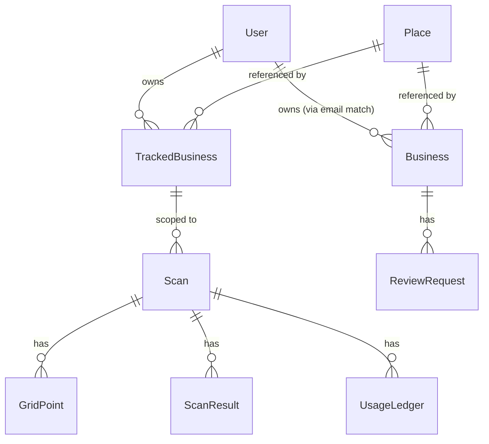

# Data Model

alauda-app's `packages/db` exports a single Prisma schema covering both
products. Models from `Local_Map_SEO` and `Review_MLP` coexist flat in
the `public` Postgres schema with no name collisions
(see [ADR-007](../architecture/decisions.md#adr-007-flat-prisma-schema-s1)).

This document is the merged-schema sketch. It names every model the
fork carries, points at the source-repo file for full field detail, and
calls out the three integration-layer field changes that the merge
forces. It is deliberately not a Prisma file — the canonical schema
lives at `packages/db/prisma/schema.prisma` once the baseline migration
lands.

## ER diagram

The `User -> Business` edge is dotted in intent: it is a runtime
**soft bridge** on `email`, not a foreign key. Every other edge is a
real Prisma relation backed by a foreign-key constraint.

## Models

Nine models ship in the baseline. One belongs to identity, six come
from the Scan tool, two come from the Reviews tool. Per-model entries
list source path, key fields, role in the merged product, and any
integration-layer change the merge forces.

### Identity

#### User

- **Origin:** `Local_Map_SEO/packages/db/prisma/schema.prisma` (model
  was effectively empty in source; the merge gives it real fields).
- **Key fields:** `id` (cuid PK), `email` (unique), `lastMagicLinkSentAt`
  (nullable timestamp, **migrated from `Review_MLP/Business`**),
  `createdAt`.
- **Role in alauda-app:** Single shared identity for both tools. The
  magic-link sign-in flow finds or creates a `User` by email; every
  authed request resolves to one `User` row.
- **Integration changes:** Gains the `lastMagicLinkSentAt` field.
  Populated by `@alauda/auth` on every magic-link send (see
  [`../specs/auth.md`](../specs/auth.md)).

### Scan tool (inherited from Local_Map_SEO)

#### Place

- **Origin:** `Local_Map_SEO/packages/db/prisma/schema.prisma`.
- **Key fields:** `googlePlaceId` (unique), `lat` and `lng` (PostGIS
  Point), `name`, `address`, business type, editorial summary,
  `lastFetchedAt`.
- **Role in alauda-app:** Cache of Google Places API responses. Shared
  by both tools — Scan looks up the tracked business plus competitors
  during ranking, and Reviews looks up the owner's business during
  onboarding. The 7-day cache TTL is inherited unchanged
  (see [`../architecture/constants.md`](../architecture/constants.md)).
- **Integration changes:** none.

#### TrackedBusiness

- **Origin:** `Local_Map_SEO/packages/db/prisma/schema.prisma`.
- **Key fields:** `id`, `userId` (FK to `User`,
  **NOT NULL post-fork-and-lift**), `placeId` (FK to `Place`),
  `nickname`.
- **Role in alauda-app:** A user-tracked business that Scan operates
  on. One user can track multiple businesses; each tracked business
  has its own scan history.
- **Integration changes:** `userId` tightens from nullable to NOT NULL.
  The change was planned in `Local_Map_SEO`'s README and is executed
  in alauda-app's baseline migration; no backfill is needed because
  alauda-app starts empty (see
  [ADR-007](../architecture/decisions.md#adr-007-flat-prisma-schema-s1)).

#### Scan

- **Origin:** `Local_Map_SEO/packages/db/prisma/schema.prisma`.
- **Key fields:** `id`, `trackedBusinessId` (FK), `keyword`,
  `radiusMeters`, `status` (`queued` / `processing` / `complete` /
  `failed`), `shareToken` (unique, used for the public share URL),
  `createdAt`, `completedAt`, `notifyEmail`.
- **Role in alauda-app:** One scan binds one keyword, one tracked
  business, and one moment in time. Each scan spawns 25 GridPoints
  and accumulates many ScanResults as the worker processes the grid.
- **Integration changes:** none.

#### GridPoint

- **Origin:** `Local_Map_SEO/packages/db/prisma/schema.prisma`.
- **Key fields:** `id`, `scanId` (FK), `gridIndex` (0-24), `lat`,
  `lng` (PostGIS Point), `status`.
- **Role in alauda-app:** One of 25 cells in the 5x5 SERP scan grid
  for a single Scan. The worker fetches one SERP per GridPoint.
- **Integration changes:** none.

#### ScanResult

- **Origin:** `Local_Map_SEO/packages/db/prisma/schema.prisma`.
- **Key fields:** `id`, `gridPointId` (FK), `placeId` (FK to a
  competitor's `Place`), `rank`, `name` (denormalized), `thumbnail`,
  `rating`.
- **Role in alauda-app:** One ranked result returned by the SERP
  provider for a given grid point. The grid heatmap reads from this
  table.
- **Integration changes:** none.

#### UsageLedger

- **Origin:** `Local_Map_SEO/packages/db/prisma/schema.prisma`.
- **Key fields:** `id`, `scanId` (FK), `provider`, `tokenCost` (or
  units), `createdAt`.
- **Role in alauda-app:** Per-scan SERP API usage tracking. Feeds the
  future credit math and billing surface; not used by any current
  customer-facing page.
- **Integration changes:** none.

### Reviews tool (inherited from Review_MLP)

#### Business

- **Origin:** `Review_MLP/prisma/schema.prisma`.
- **Key fields:** `id`, `name`, `ownerEmail` (unique,
  **soft bridge to `User.email` — no FK**), `ownerFirstName`,
  `googlePlaceId`, `googleReviewUrl`, `googleBusinessType`,
  `googleEditorialSummary`, `ownerDescription`, `aiPromptOverride`,
  `smsTemplate`.
- **Role in alauda-app:** Reviews tool's per-business config and
  identity. In the source repo the model also held auth state; that
  state has moved to `User` in the merge.
- **Integration changes:** Removes `lastMagicLinkSentAt`. The field
  has moved to `User`.

#### ReviewRequest

- **Origin:** `Review_MLP/prisma/schema.prisma`.
- **Key fields:** `id`, `businessId` (FK), `deliveryChannel`, phone
  and email plus their hashes, scheduling timestamps
  (`scheduledSendAt`, `sentAt`, `clickedAt`, `ratedAt`,
  `googleClickedAt`, `feedbackSubmittedAt`), `rating`, `reviewText`,
  `aiSuggestedReview`, `routedTo`, `optedOut`, `smsSid`,
  `smsDeliveredAt`, `token` (unique, used for the public rating link),
  `createdAt`.
- **Role in alauda-app:** A single customer review request and its
  full funnel state from scheduling through delivery, rating, and
  Google handoff.
- **Integration changes:** none.

## Integration-layer changes (only)

The merge touches exactly three fields. Every other field on every
other model ships verbatim from its source repo.

- `User` gains `lastMagicLinkSentAt` (nullable timestamp). Populated
  by `@alauda/auth`. Migrated semantic from
  `Review_MLP/Business.lastMagicLinkSentAt`.
- `TrackedBusiness.userId` is tightened from nullable to NOT NULL.
  The baseline migration enforces this; no backfill is needed because
  alauda-app starts empty.
- `Business.lastMagicLinkSentAt` is removed. Moved to `User`.

## Bridging rules

Three rules describe how identity, ownership, and onboarding line up
between models that did not previously share a database.

- **Reviews ownership** — runtime check
  `Business.ownerEmail = currentUser.email`. **No FK; soft bridge.**
  Trades referential integrity for zero schema change to `Business`,
  matching ADR-004's
  [`A1` resolution](../architecture/decisions.md#adr-004-magic-link-auth-in-packagesauth-a1).
- **Scan ownership** — relation
  `TrackedBusiness.userId = currentUser.id`. **Hard FK** after the
  baseline migration enforces NOT NULL. Referential integrity is
  guaranteed by the database, not by application logic.
- **Onboarding dual-write** — first login creates one `Business`
  (Reviews) plus one `TrackedBusiness` (Scan) sharing one `Place`,
  all in a single transaction. Detail in
  [`../specs/shell.md`](../specs/shell.md).

## Migration policy

alauda-app uses a **baseline reset**. The first Prisma migration in
`prisma/migrations/` is the full merged-schema initialization, not a
replay of either source repo's migration history. The reset is
acceptable because alauda-app has no paid users to protect during
alpha (see
[ADR-010](../architecture/decisions.md#adr-010-source-repo-coexistence-alpha--isolation));
attempting to merge two independent migration graphs cleanly would
cost more than it would save.

The single first migration carries every table, index, and PostGIS
extension the merged product needs. It also encodes the three
integration-layer changes — `User.lastMagicLinkSentAt`,
`TrackedBusiness.userId NOT NULL`, and the absence of
`Business.lastMagicLinkSentAt` — so no follow-up migration is needed
to reconcile the source-repo shapes.

Future schema changes are written manually per alauda-app, not copied
from source repos. When a source repo evolves a model, the change
flows in through the
[`../plan/sync-strategy.md`](../plan/sync-strategy.md) Phase 7 window:
the diff is read, an alauda-app migration is authored by hand, and the
provenance comment on the affected file is updated. Mechanical mirror
of upstream migrations is explicitly rejected because the integration
layer (auth bridge, ownership rules, the three field changes above)
would silently regress.
